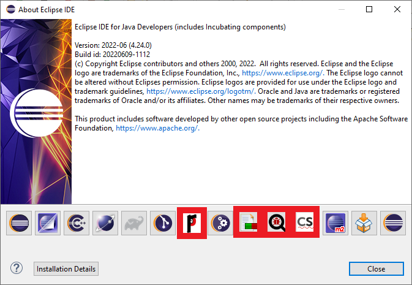
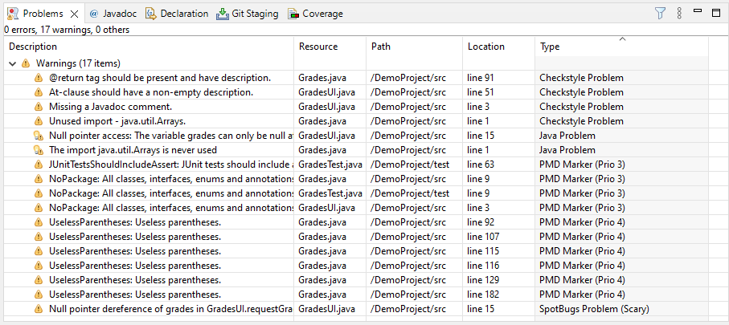
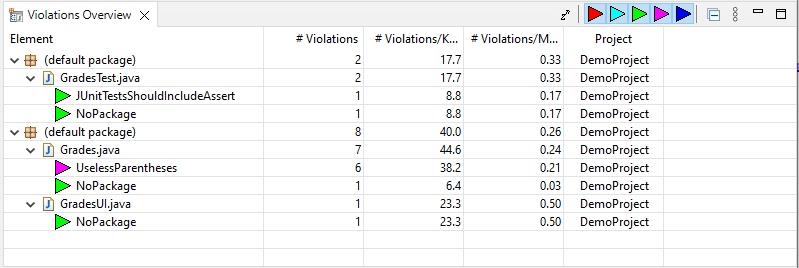
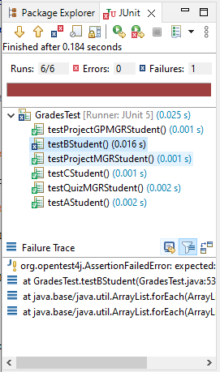
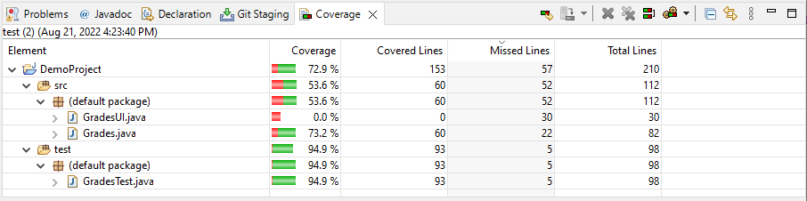
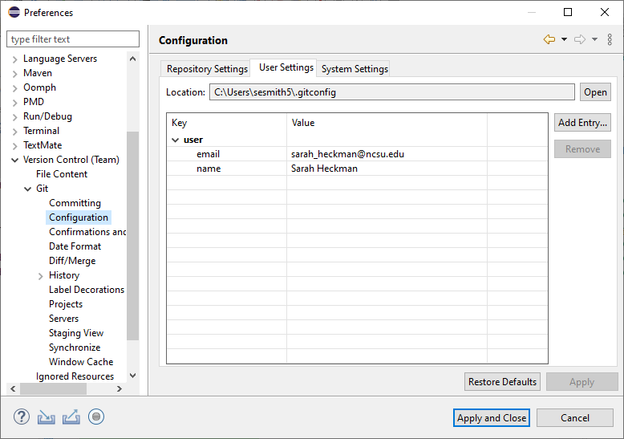

For [Lab 00](https://docs.google.com/a/ncsu.edu/presentation/d/e/2PACX-1vTz25GRywqHLJpSLpZ448HEJy0NP3UJ_dRz2Ecqn6PTp_Yq9izFZhGV-McFCyeaVSOgHyhTFe-9DPIX/pub?start=false&loop=false&delayms=60000) 
 learn about GitHub, the version control system we use in CSC 216/217 and set up your development environment for CSC 216/217.



  * Practice working on a pair or small team to understand the benefits
  * Learn about the version control system GitHub
  * Set up a development environment for CSC 216/217



<!--
## Pair Activity (Synchronous Students ONLY)

Your lab PTF will lead you through a lab pair activity that explores responsible computing.
-->

## CSC 217 & Lab 00 Overview
Watch the following video for an introduction to CSC 217, GitHub, and Lab 00.

**NOTE: The dates in the slides in the video are incorrect.  The correct dates are in the writeup and on the schedule!**

<iframe src="https://ncsu.hosted.panopto.com/Panopto/Pages/Embed.aspx?id=de2445d7-758b-49fe-b5e7-ad8500f90156&autoplay=false&offerviewer=true&showtitle=true&showbrand=false&captions=false&start=0&interactivity=all" height="405" width="720" style="border: 1px solid 464646;" allowfullscreen allow="autoplay"></iframe>


## GitHub Overview

We'll be using [NCSU's GitHub Enterprise service](http://github.ncsu.edu) for submission of most work in CSC 216/217 this semester.  Take a look through the [GitHub tutorial](https://pages.github.ncsu.edu/engr-csc-software-development/practices-tools/git/).  It's an excellent resource for when you run into issues with GitHub (which is used in most CSC classes from this point forward and GitHub or similar tools are used in industry - version control is something that you have to know to be an effective developer).


## Development Environment Installation


For Lab 0, you will have the opportunity to set up your development environment.  Go through the [Eclipse Install Tutorial](https://pages.github.ncsu.edu/engr-csc-software-development/practices-tools/eclipse/eclipse-install.html).  If you have any questions, please come to office hours or post to Piazza!

**After setting up your development environment, you will demo your setup for the teaching staff as outlined below.  Please go through the demo steps BEFORE checking in with the teaching staff or recording the video for grading.**

There are several options for how you can receive credit for your Lab 00 demo:

  * Attend office hours of any CSC 216/7 PTF or instructor and run through the demo outlined below.  They will grade your demo and if there are missing items they will let you know and you can revise (independently) for another review.
  * Record a video of your demo and submit to Moodle for a review by the Lab 00 deadline. We encourage you to use [Open Broadcaster Software](https://obsproject.com/) to record your demo.  Submit on **the lab CSC 217 Moodle**.
  
Submissions to GitHub without an associated office hour or video demo will be graded for partial credit; however, there are parts of the Lab 00 expectations that we cannot see on GitHub alone.

**Lab 00 is due by September 6th at 11:45pm for all sections.**


### Demo Step 1: Launch Eclipse
Launch Eclipse and show that all plug-ins are installed.  You can see the icons for installed plug-ins by selecting **Help > About Eclipse IDE.** The icons of the required plug-ins are highlighted in red and may appear in a different order than the screenshot.  



**Demo:** Eclipse is open

### Demo Step 2: Import Demo Project
To ensure that all of the plug-ins are configured correctly, download the [Demo Eclipse Project](files/demo.zip).  Import the project into your workspace:

  1. Right click in the **Package Explorer** and select **Import > General > Existing Projects into Workspace**.  Click **Next**.
  2. Select the radio button **Select archive file** and **Browse** for `demo.zip`. 
  3. Make sure that `DemoProject` is selected in the **Projects** text area and click **Finish**.
  4. `DemoProject` should now be listed in the **Package Explorer**.
  
Wait a bit for the project to build.  If your project has a big red exclamation point icon over the project folder your project was unable to build due to a path issue within Eclipse.  To fix, do the following:

  1. Right click on the project and select **Properties > Java Build Path > Libraries tab**. 
  2. Select the JRE System Library (which will be labeled unbound) and click **Remove**.
  3. Select **Modulepath**.
  4. Click **Add Library...**.
  5. Select **JRE System Library**. Click **Next**.
  6. Select the radio button for **Workspace default JRE (jdk 17 name)**. Click **Finish**.  Note that the JRE 17 name will vary depending on the name of your local default JDK/JRE.  If your default JRE is not version 17, go back to the [Java in Eclipse section of the Install Tutorial](https://pages.github.ncsu.edu/engr-csc-software-development/practices-tools/eclipse/eclipse-install.html#java-in-eclipse).
  
**Demo:** Open the DemoProject and ensure that the JRE System Library is listed as `[jdk-17.0.4]` or some other version of Java 17.

![*JRE System Library [jdk-17]*](images/Java.PNG)

### Demo Step 3: Run CheckStyle
CheckStyle needs to be turned on for each project so that it will run with every build.  To activate CheckStyle for a project, do the following:

  1. Right click on the project and select **Properties > Checkstyle**.
  2. Click the check box next to **Checkstyle active for this project**.  Ensure that the CSC 216/217 configuration is selected.
  3. Click **Apply and Close**.
  
After running CheckStyle you should see 4 notifications in the **Problems** view.  If you see more than this, you didn't [configure CheckStyle properly](https://pages.github.ncsu.edu/engr-csc-software-development/practices-tools/eclipse/eclipse-install.html#checkstyle).

**Demo:** Appropriate notifications are displayed.



### Demo Step 4: Run SpotBugs
SpotBugs needs to be turned on for each project so that it will run with every build.  To activate SpotBugs for a project, do the following:

  1. Right click on the project and select **Properties > SpotBugs**.
  2. Click the check box next to **Run automatically**.
  3. Click **Apply and Close**.
  
After SpotBugs is active, run by right-clicking on the project and selecting **SpotBugs > FindBugs**.
  
After running SpotBugs you should see 1 notification in the **Problems** view of type **SpotBugs Problem**.  If you see more than this, you didn't [configure SpotBugs properly](https://pages.github.ncsu.edu/engr-csc-software-development/practices-tools/eclipse/eclipse-install.html#spotbugs).

**Demo:** Appropriate notifications are displayed.


### Demo Step 5: Run PMD
PMD needs to be turned on for each project so that it will run with every build.  To activate PMD for a project, do the following:

  1. Right click on the project and select **Properties > PMD**.
  2. Click the check box next to **Enable PMD**.
  3. Click **Apply and Close**.
  
To see PMD notifications, you need to add the PMD **Violations Overview** view to your Java Perspective by selecting **Windows/Eclipse > Other > PMD > Violations Overview**.  There should be 10 PMD notifications across the `src/` and `test/` folders. If you see more than this, you didn't [configure PMD properly](https://pages.github.ncsu.edu/engr-csc-software-development/practices-tools/eclipse/eclipse-install.html#pmd).

**Demo:** Appropriate notifications are displayed.



### Demo Step 6: Run Unit Tests for Coverage
We will run automated unit tests on our code this semester and assess the quality of tests through code coverage.  To run unit tests instrumented for coverage, do the following:

  1. Open the project.  Right click on the `test/` folder and select **Coverage As > JUnit Test**.
  2. The tests will run and results will show with a red bar.  X out of Y tests are failing.
  3. A coverage report will show. In the upper right menu, select the three vertical dots (or possibly, a white triangle pointing down) and click on **Line counters**. You'll see 73.2% line coverage for the `Grades` class; 0% line coverage for `GradesUI` class; and 94.9% line coverage for `GradesTest` class.
  
**Demo:** Appropriate test results and coverage are displayed.





### Demo Step 7: Git Configuration in Eclipse
Ensure that you have [configured Git in Eclipse](https://pages.github.ncsu.edu/engr-csc-software-development/practices-tools/eclipse/eclipse-install.html#git-configuration) with your name and NCSU email address. You can demonstrate the configuration by:

  1. Select
     * Windows users: **Window > Preferences > Version Control (Team) > Git > Configuration**.
     * Mac users: **Eclipse > Preferences > Version Control (Team) > Git > Configuration**.
  2. Open up the **user** label to show **name** and **email** address.  You *MUST* use your NCSU email address.
  
**Demo:** Your name and NCSU email address are displayed.



### Demo Step 8: Push Demo Project to GitHub
You have been assigned a GitHub repository for Lab 00.  Push your DemoProject to GitHub (this should be done before you do the live demo or recording).  See [slides 26-29](https://docs.google.com/presentation/d/e/2PACX-1vTz25GRywqHLJpSLpZ448HEJy0NP3UJ_dRz2Ecqn6PTp_Yq9izFZhGV-McFCyeaVSOgHyhTFe-9DPIX/pub?start=false&loop=false&delayms=60000&slide=id.g4b93c18dbe_1_87), the [Git Guide](https://pages.github.ncsu.edu/engr-csc-software-development/practices-tools/git/), or the [Git instructions from Guided Project 1](https://pages.github.ncsu.edu/engr-csc216/guided-projects/gp1/gp1-github.html).  Note that you'll have a repository in a GitHub Organization that matches the pattern of engr-csc216-[semester][year].

When you're done, check on NCSU's GitHub website that the `DemoProject` folder is listed. During the demo, the teaching staff can check your repo or have you share your repository page for Lab 0 in your browser.  If you are recording a video, you can show your project's GitHub webpage in your browser.


### Demo Step 9 [optional + extra credit]: Git Configuration on Command Line
If you have [installed Git for your operating system and configured your global user name and email settings](https://pages.github.ncsu.edu/engr-csc-software-development/practices-tools/git/git-config.html), show the PTF via the following command from your favorite command line tool:

```bash
$ git config --list
```

Your name and NCSU email address should be listed under `user.name` and `user.email`:

```bash
...
user.name=Sarah Heckman
user.email=sarah_heckman@ncsu.edu
...
```

**Demo:** Your name and NCSU email address are displayed.

## Lab Deadlines
For Lab 0, you are expected to: 

  * participate in the pair programming activity (synchronous lab sections only), 
  * review of GitHub, and 
  * demonstrate that you have successfully set up your personal development environment either to a PTF/instructor or through a demo video submitted to the CSC 217 Moodle.  
  
Participation in the pair programming activity will occur during lab.  The deadline for demonstration of your personal development environment is {{site.data.labs.lab00.wed00}} {{site.data.labs.lab651time}} for all sections.  You must show your setup to your lab PTF (or another PTF during office hours) or submit a video of your environment for evaluation.

Students in async lab sections should watch the Lab 00 overview video and complete the development environment setup. Async labs will only be graded out of 90 points.


## Lab Rubric
You will be evaluated on demonstration that you have successfully set up your personal development environment.

## Grading Rubric


### Development Environment Setup Rubric
 

<!--
### Collaborative Activity
 
-->
