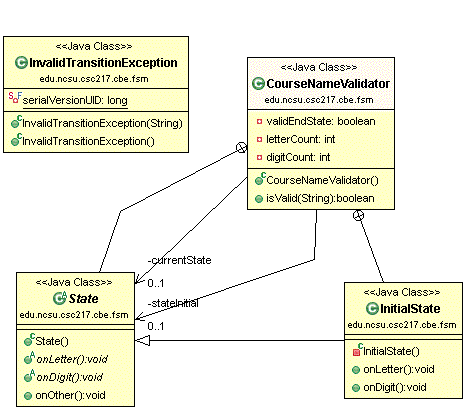

# CSC 217 CBE - Finite State Machines

For the FSM portion of the CBE you will complete the following tasks:

  * [Requirements](#requirements)
  * [FSM Design](#fsm-design)
  * [Design](#design)
  * [Implement & Unit Test](#implement)
  * [Test & Coverage](#test)
  * [Review](#review)
  * [Evaluation](#evaluation)
  
You are encouraged to commit/push your changes to GitHub frequently so that you do not lose work!

## Requirements

Create a finite state machine that identifies if a course name string is valid or invalid.  

**A valid course name begins with 1-4 letters, followed by exactly 3 digits, followed by an optional 1 letter suffix.  If a course name doesn't meet the description, the course name is invalid.** 

  

## FSM Design
Create a FSM diagram that identifies a valid or invalid course name as described in the [requirements](#requirements).

### Tools
There are several tools that you may use to design your FSM:

  * [Finite State Machine Designer](http://madebyevan.com/fsm/) - recommended for use, you'll need to screenshot the FSM and save as an image file.
  * [UMLetino](http://www.umlet.com/umletino/umletino.html)
     * There's a drop down menu in the upper right where the icons are.  Select UML State Machine.  
     * The final/end states are represented with the solid circle surrounded with another circle rather than the state circle.

### Submission
Export or save your FSM as an image file called `fsm-design.*`, where the file type can be `*.gif`, `*.jpeg`, or `*.png`.  Create a `project_docs` folder in your `CSC217CBE` project.  Save your FSM image file in the `project_docs` directory of `CSC217CBE`.

Note that as you continue working on the task, you may want to refine your FSM.  You are welcome to do so throughout the task.

## Design
Use the following class diagram as the design for your implementation.  Additional details about expectations in the [Implement](#implement) section.

## Implement & Unit Test
Implement the finite state machine you designed in the `edu.ncsu.csc217.cbe.fsm.CourseNameValidator` class.  Your implementation must conform to the design shown above. 

The design shows two public classes: `CourseNameValidator` and `InvalidTransitionException`.  The `State` abstract class is a `private` inner class of `CourseNameValidator`.  `InitialState` is a `private` inner class of `CourseNameValidator` that extends `State`.  This is an example of what **one** of the concrete `State` classes should look like.  You will create additional concrete `*State` classes appropriate for your finite state machine as designed above.

Note that anything private in the class diagram is optional.  The teaching staff solution has those private elements and they were useful for implementation, but you may not need them.  You can also add additional private fields and private methods to solve the problem.

The `CourseNameValidator` method should accept a string and attempt to validate it as described above.  The method should return true if the string conforms to the requirements.  The method should return false if after processing the string the finite state machine is not in a final state.  The method should throw an `InvalidTransitionException` if the next character is an inappropriate character type for the current state.  Write unit tests for your `CourseNameValidator` as you implement it to ensure things are working.  

## Test and Coverage
As you implement `CourseNameValidator`, you should also be unit testing it.  Here are some examples to consider:

  * CSC217 - returns true
  * CSC21 - returns false - would finishing processing in a non-final state
  * CSC 217 - throws an exception - invalid character
  
Write your unit tests in `CourseNameValidatorTest` in the `test/` folder.

You are expected to achieve **80% statement coverage** of your `CourseNameValidator` class when running your tests.  Once you meet the coverage threshold from your passing tests, you will see the teaching staff test feedback on Jenkins.  Use the teaching staff tests to refine your tests and fix any bugs in your code.

Run static analysis tools and ensure that all notifications are fixed.

## Review
Ensure everything is pushed to the remote GitHub.  Check for the following:

  - `CourseNameValidator` in `src/edu/ncsu/csc217/cbe/fsm` directory
  - `CourseNameValidatorTest` in `test/edu/ncsu/csc217/cbe/fsm` directory
  - `fsm-design.*` is in `project_docs/` 
  - Your tests are passing on Jenkins
  - Coverage of `CourseNameValidator` exceeds 80% statement coverage
  - No notifications from static analysis tools
  - Javadoc your source and test classes
  - Teaching staff tests are passing on Jenkins

 