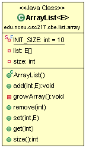

# CSC 217 CBE - ArrayLists

For the ArrayLists portion of the CBE you will complete the following tasks:

  * [Requirements](#requirements)
  * [Design](#design)
  * [Implement & Unit Test](#implement)
  * [Test & Coverage](#test)
  * [Review & Commit/Push](#review)
  * [Evaluation](#evaluation)
  
You are encouraged to commit/push your changes to GitHub frequently so that you do not lose work!

<a id="requirements"></a>
## Requirements
Implement an `ArrayList` that meets the following requirements:

  * Automatically grows as elements are added
  * Throws `NullPointerException` for any null elements
  * Throws `IndexOutOfBoundsExceptions` for any index parameters that are out of bounds for the operation
  * Throws `IllegalArgumentExceptions` for any duplicate elements

<a id="design"></a>
## Design
Use the following class diagram as the design for your implementation.  Additional details about expectations are in the [Implement](#implement) section.

Your `ArrayList` MUST extend `java.util.AbstractList`.  Refer to the [`java.util.AbstractList` Java API page](https://docs.oracle.com/en/java/javase/11/docs/api/java.base/java/util/AbstractList.html) for additional details that will help your implementation.



<a id="implement"></a>
## Implement and Unit Test
Complete the following steps to implement your custom `ArrayList`.  You are *strongly* encouraged to alternate writing unit tests and solution code rather than waiting for a complete implementation to test.

### Setup

  * Create a package `edu.ncsu.csc217.cbe.list.array` in the `src/` folder.
  * Create a class `ArrayList`, which should extend `java.util.AbstractList` and should have a generic type parameter, `E`.  Your class header should look like the following

```java
public class ArrayList<E> extends AbstractList<E> {
```

  * Create a package `edu.ncsu.csc217.cbe.list.array` in the `test/` folder.
  * Create an `ArrayListTest` class in the above package.
  
### Implement `ArrayList` State
`ArrayList` has the following state (which you cannot test directly because they must be private):

  * `INIT_SIZE`: a constant value for initializing the list size.  The value should be 10.
  * `list`: an array of type `E`
  * `size`: the size of the list
  

### Implement and Test `ArrayList.ArrayList()`
Write a test for `ArrayList`'s constructor.  You should implement `ArrayList.size()` to help with testing the constructor.

The constructor of `ArrayList` should create an empty `ArrayList` (e.g., `size` is zero) with a `list` of capacity `INIT_SIZE`.  Remember, you cannot directly construct an array of type `E`.  Instead you have to create an array of `Object`s and cast to an array of type `E`.  You may add the annotation `@SuppressWarnings("unchecked")` above the constructor to remove the warning about an unchecked cast.


### Implement and Test `ArrayList.add(int, E)`
Write tests for `ArrayList.add(int, E)`.  You should implement `ArrayList.get()` so that you can test the contents of the list after adding elements.

Override and implement the `ArrayList.add(int, E)` method that will add the element to the given index.  If the element is inserted at the front or the middle of the list, the other elements are shifted to make room.  If the size is equal to the capacity, the list should automatically double in capacity to make room for the new element.  The private method `growArray()` is used to double the capacity.  You may create a private method or implement the grow functionality in the `add()` method.

If the element to add is null, the method should throw a `NullPointerException`.

If the element to add is a duplicate of an element already in the list as determined by the `equals()` method, the method should throw an `IllegalArgumentException`.  

If the index is out of range `(index < 0 || index > size())`, the method should throw an `IndexOutOfBoundsException`.


### Implement and Test `ArrayList.remove(int)`
Write tests for `ArrayList.remove(int)`.  `ArrayList.remote(int)` should return the element removed and the return type should be `E`.

Override and implement the `ArrayList.remove(int)` method so that it will remove elements at the given index.  If an element at the front or middle of the list is removed, the elements are left shifted to close the gap.  Don't forget to set the element at `size-1` to null after the left shift to remove the extra reference.

If the index is out of range `(index < 0 || index >= size())`, the method should throw an `IndexOutOfBoundsException`.


### Implement and Test`ArrayList.set(int, E)`
Write tests for `ArrayList.set(int, E)`.  `ArrayList.set(int, E)` should return the original element at the location and the return type should be `E`.

Override and implement the `ArrayList.set(int, E)` method so that the element at the specified index is replaced with the given element.

If the element to set is null, the method should throw a `NullPointerException`.

If the element to set is a duplicate of an element already in the list as determined by the `equals()` method, the method should throw an `IllegalArgumentException`.  

If the index is out of range `(index < 0 || index >= size())`, the method should throw an `IndexOutOfBoundsException`.


## Implement and Test `ArrayList.get(int)`
Write tests for `ArrayList.get(int)` that consider when the index is out of range.  `ArrayList.get(int)` returns the element at the index and the return type is `E`.

Override and implement the `ArrayList.get(int)` method so that it will return elements at the given index.  

If the index is out of range `(index < 0 || index >= size())`, the method should throw an `IndexOutOfBoundsException`.


<a id="test"></a>
## Testing and Coverage
As you implement `ArrayList`, you should also be unit testing it.  Make sure that you're testing the size AND contents to ensure everything works correctly.

You are expected to achieve **80% statement coverage** of your `ArrayList` class when running your tests.  Once you meet the coverage threshold from your passing tests, you will see the teaching staff test feedback on Jenkins.  Use the teaching staff tests to refine your tests and fix any bugs in your code.

Run static analysis tools and ensure that all notifications are fixed.

## Review
Ensure everything is pushed to the remote GitHub.  Check for the following:

  - `ArrayList` in `src/edu/ncsu/csc217/cbe/list/array` directory
  - `ArrayListTest` in `test/edu/ncsu/csc217/cbe/list/array` directory
  - Your tests are passing on Jenkins
  - Coverage of `ArrayList` exceeds 80% statement coverage
  - No notifications from static analysis tools
  - Javadoc your source and test classes
  - Teaching staff tests are passing on Jenkins


 