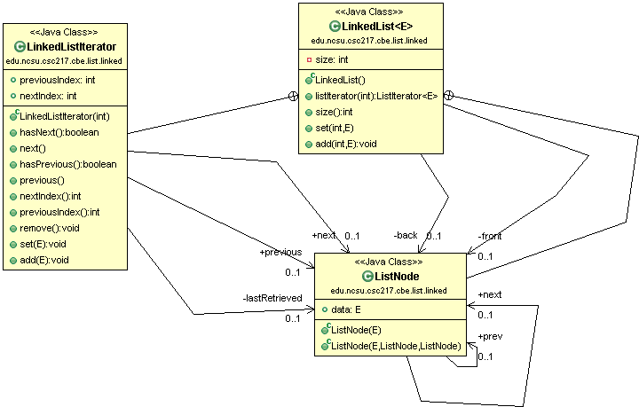
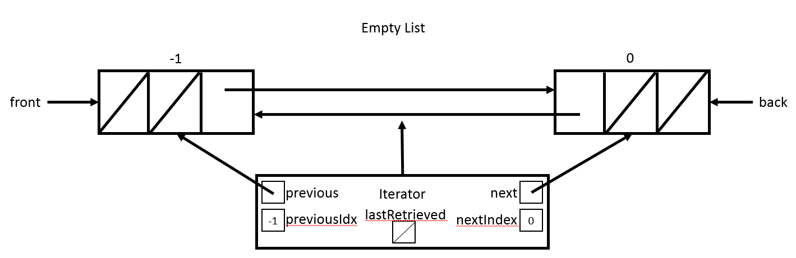
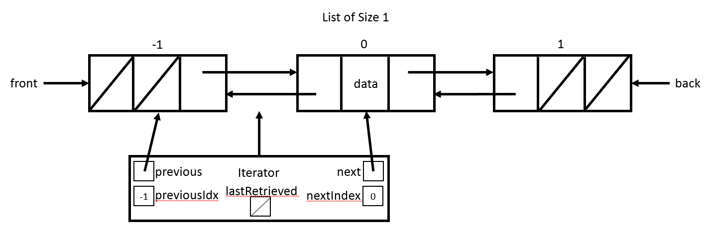

# CSC 217 CBE - LinkedLists and Iterators

For the LinkedLists portion of the CBE you will complete the following tasks:

  * [Requirements](#requirements)
  * [Design](#design)
  * [Implement & Unit Test](#implement)
  * [Test & Coverage](#test)
  * [Review & Commit/Push](#review)
  * [Evaluation](#evaluation)
  
You are encouraged to commit/push your changes to GitHub frequently so that you do not lose work!

<a id="requirements"></a>
## Requirements
Implement a `LinkedList` that meets the following requirements:

  * Automatically grows as elements are added
  * Throws `NullPointerException` for any null elements
  * Throws `IndexOutOfBoundsExceptions` for any index parameters that are out of bounds for the operation
  * Throws `IllegalArgumentExceptions` for any duplicate elements

<a id="design"></a>
## Design
Use the following class diagram as the design for your implementation.  Additional details about expectations are in the [Implement](#implement) section.

Your `LinkedList` MUST extend `java.util.AbstractSequentialList`.  Refer to the [`java.util.AbstractList` Java API page](https://docs.oracle.com/en/java/javase/11/docs/api/java.base/java/util/AbstractSequentialList.html) for additional details that will help your implementation.



<a id="implement"></a>
## Implement & Unit Test
Complete the following steps to implement your custom `LinkedList`.  You are *strongly* encouraged to alternate writing unit tests and solution code rather than waiting for a complete implementation to test.

### Setup

  * Create a package `edu.ncsu.csc217.cbe.list.linked` in the `src/` folder.
  * Create a class `LinkedList`, which should extend `java.util.AbstractSequentialList` and should have a generic type parameter, `E`.  Your class header should look like the following

```java
public class LinkedList<E> extends AbstractSequentialList<E> {
```

  * Create a package `edu.ncsu.csc217.cbe.list.linked` in the `test/` folder.
  * Create an `LinkedListTest` class in the above package.
  
Note: You should be able to reuse your test cases for `ArrayList` with `LinkedList`.  They are both `List`s.  Make sure that you update the tests to work with the `LinkedList` object rather than the `ArrayList`.

### Implement `ListNode`
`ListNode` is an inner class of `LinkedList`.  Add the class after the last method but before closing the `LinkedList` curly brace.  The `ListNode` class header should look like the following:

    private class ListNode { ... }
    
Note that `ListNode`'s constructor has no generic type in this implementation.  `ListNode` will use `LinkedList`'s generic type.  

`ListNode` has three public fields.  Add the fields to the `ListNode` class:

  * `data`: type `E` - the data in the node
  * `next`: type `ListNode` - the next node in the list
  * `prev`: type `ListNode` - the previous node in the list
  
`ListNode` has two constructors.  Add the constructors to the `ListNode` class.  They should assign the parameter to the associated fields:

  * `ListNode(E data)`
  * `ListNode(E data, ListNode prev, ListNode next)`


### Create `LinkedListIterator`
`AbstractSequentialList` provides functionality for all standard list methods by implementing them in terms of an `Iterator`.  That means to create a concrete implementation of `AbstractSequentialList`, you need to [implement the `ListIterator` interface](https://docs.oracle.com/javase/8/docs/api/java/util/ListIterator.html).  Create an inner class named `LinkedListIterator` that implements the `ListIterator` interface.  The `LinkedListIterator` class header should look like the following:

    private class LinkedListIterator implements ListIterator<E> { ... }
    
`LinkedListIterator` has five fields:

  * `previous`: represents the `ListNode` that would be returned on a call to `previous()`
  * `next`: represents the `ListNode` that would be returned on a call to `next()`
  * `previousIndex`: the index that would be returned on a call to `previousIndex()`
  * `nextIndex`: the index that would be returned on a call to `nextIndex()`
  * `lastRetrieved`: represents the `ListNode` that was returned on the last call to either `previous()` or `next()` or null if a call to `previous()` or `next()` was not the last call on the `ListIterator`.

In addition to the eight methods from `ListIterator` that you must override (and will implement in the following steps), `LinkedListIterator` has a constructor that accepts an index to position the iterator.  For now, stub out the constructor.  You'll implement it later.

    public LinkedListIterator(int index) { 
       //TODO implement later
    }
    
The `LinkedListIterator` is an object that represents the current location of the `LinkedListIterator` in the `LinkedList`.  Because you are working with a doubly linked list, the `LinkedListIterator` can move forward or backward in the list during traversal.  That means that the current location of the `LinkedListIterator` is always between TWO `ListNode`s.  To simplify the implementation of the `LinkedListIterator` methods, the `LinkedList` class will always have two `ListNodes` with null data.  These nodes represent the idea of index -1 and index size in our list.  By having these null data `ListNode`s the `LinkedListIterator` is always between two `ListNode`s even when the `LinkedListIterator` is at the front of the list or back of the list.  The model is shown in the figure below.




  

### Implement `LinkedList` State
`LinkedList` has the following state:

  * `front`: a `ListNode`
  * `back`: a `ListNode`
  * `size`: the size of the list
  

### Implement and Test `LinkedList.LinkedList()`
The constructor of `LinkedList` should initialize the state.  To fit the model where a `LinkedListIterator` should always be between two `ListNode`s, you need to create two `ListNode`s with null data that represent the idea of nodes that are out of bounds at indexes -1 and `size` so that your empty list looks like:


That means the constructor of `LinkedList` should do the following:

  * Create a `ListNode` with `null` data that `front` points to.
  * Create a `ListNode` with `null` data that `back` points to.
  * Have `front`'s `next` point to `back`
  * Have `back`'s `prev` point to `front`
  * Initialize `size` to 0.


### Implement and Test `LinkedList.size()`
One of the two abstract methods in `AbstractSequentialList` is `size()`.  Implement `size()` to return the `size` field.


### Implement and Test `LinkedList.listIterator()`
The other abstract method in `AbstractSequentialList` is `listIterator()`.  The method returns a `ListIterator<E>` that is positioned such that a call to `ListIterator.next()` will return the element at given index ([as per the `AbstractSequentialList` API](https://docs.oracle.com/javase/8/docs/api/java/util/AbstractSequentialList.html).  All `LinkedList.listIterator()` does is construct a `LinkedListIterator` object.  When constructing the `LinkedListIterator` object, you don't need the generic type on the constructor because the generic type is handled by extending `ListIterator<E>`!


### Implement and Test `LinkedListIterator.LinkedListIterator()`
The constructor for `LinkedListIterator` recieves an index for positioning the `LinkedListIterator` in the list.  That means the constructor needs to traverse to the appropriate location, which is between `index-1` and `index`.  That means you [satisfy the instructions in `AbstractSequentialList` that the value at `index` is what is returned on a call to `next()`](https://docs.oracle.com/javase/8/docs/api/java/util/AbstractSequentialList.html).  To implement `LinkedIntListIterator()`, do the following:

  * Check the `index` to ensure that it's within bounds of the list.  If not, throw an `IndexOutOfBoundsException` that will propagate through the `LinkedList.listIteartor()` method.
  *  If the `index` is within bounds, iterate through the list so that the `previous` `ListNode` points to the `ListNode` at `index-1` and the `next` `ListNode` points to the `ListNode` at `index`.
  * Update the `previousIndex` and `nextIndex` fields.
  * `lastRetrieved` should be null.
  
By implementing the padding of a lead and trailing `ListNode` with `null` data, you  ensure that `previous` points to the `ListNode` with `null` data when the `LinkedListIterator` is at the front of the list and that `next` points to the `ListNode` with `null` data when the `LinkedListIterator` is at the end of the list. 


### Implement and Test `LinkedListIterator.has*()` and `LinkedListIterator.*Index()` Methods
The `LinkedListIterator.has*()` method return true if there is a `next` or `previous` node in the list (i.e., a `ListNode` where the `data` is not null).  [Implement the `has*()` methods using the API for guidance](https://docs.oracle.com/javase/8/docs/api/java/util/ListIterator.html).

The `LinkedListIterator.*Index()` methods return the index of the `next` or `previous` node in the list.  [Implement the `*Index()` methods using the API for guidance](https://docs.oracle.com/javase/8/docs/api/java/util/ListIterator.html).

Start running your tests and ensure that the the tests that don't involve adding, removing, or setting pass.  


### Implement and Test `LinkedListIterator.next()` and `LinkedListIterator.previous()` Methods
The `LinkedListIterator.next()` and `LinkedListIterator.previous()` methods return the element in the `next` or `previous` `ListNode`. If the `next` or `previous` `ListNode` has `null` `data`, you should throw a `NoSuchElementException`. Remember, the `next()` and `previous()` methods will move forward or backward through the list before returning the value but after retrieving the value to return.

The `next()` and `previous()` methods should set `lastRetrieved` to the `ListNode` that contains the returned value.  This will be used in the methods for modifying the list as a flag for if an operation can happen.

Run your tests to ensure no regressions.


### Implement and Test `LinkedListIterator.add(E)`
Override and implement the `LinkedListIterator.add(E)` method.  As per the [`ListIterator` API](https://docs.oracle.com/javase/8/docs/api/java/util/ListIterator.html), the `add()` method will insert the element before the element that would be returned by `next()`.  Don't forget to increment `size`. The API states:

    Inserts the specified element into the list (optional operation). The element is inserted immediately before the element that would be 
    returned by next(), if any, and after the element that would be returned by previous(), if any. (If the list contains no elements, the 
    new element becomes the sole element on the list.) The new element is inserted before the implicit cursor: a subsequent call to next 
    would be unaffected, and a subsequent call to previous would return the new element. (This call increases by one the value that would 
    be returned by a call to nextIndex or previousIndex.)
    
When implementing this method, do not allow null objects to be inserted.  Those are special values for our leading and trailing `ListNode`s.  If the element to add is null, the method should throw a `NullPointerException`.

After the `add()` method is done, `lastRetrieved` should be set to `null`.  `lastRetrieved` should only have a value after a call to `next()` or `previous()`.

After implementing `LinkedListIterator.add()`, your `LinkedList.add()` method should pass for everything except duplicate values and `LinkedList.get()` test should pass.


### Override and Test `LinkedList.add(int, E)`
Checking for duplicate values in `LinkedListIterator.add()` isn't possible.  The `LinkedListIterator` is already in position to add.  Therefore, you have to override `LinkedList.add(int, E)` to add a check for a duplicate value.  

Put your cursor in the editor between the `LinkedList.size()` and `LinkedList.listIterator()` methods.  Then right click and select **Source > Override/Implement Methods**.  Select `AbstractSequentialList<E>.add(int, E)`.  

If the element to add is a duplicate of an element already in the list as determined by the `LinkedList.contains()` method, the method should throw an `IllegalArgumentException`.  

After overriding and implementing `LinkedList.add(int, E)`, make sure your `LinkedList.add()` method passes.


### Implement and Test `LinkedListIterator.set(E)`
Override and implement the `LinkedListIterator.set(E)` method.  As per the [`ListIterator` API](https://docs.oracle.com/javase/8/docs/api/java/util/ListIterator.html), the `set()` method will modify the element returned by the last call to `previous()` or `next()`.  The API states: 

    Replaces the last element returned by next() or previous() with the specified element (optional operation). This call can be made 
    only if neither remove() nor add(E) have been called after the last call to next or previous.

If `lastRetrieved` is `null`, meaning that `remove()` or `add(E)` was the last call on the list or there has not been a call to `next()` or `previous()`, an `IllegalStateException` should be thrown.

When implementing this method, do not allow `null` objects to be set.  Those are special values for the leading and trailing `ListNode`s.  If the element to set is `null`, the method should throw a `NullPointerException`.

After implementing `LinkedListIterator.set()`, your `LinkedList.set()` method should pass for everything except duplicate values.


### Override and Test `LinkedList.set(int, E)`
Checking for duplicate values in `LinkedListIterator.set()` isn't possible.  The `LinkedListIterator` is already in position to set.  Therefore, you must override `LinkedList.set(int, E)` to add a check for a duplicate value.  

Put your cursor in the editor between the `LinkedList.size()` and `LinkedList.listIterator()` methods.  Then right click and select **Source > Override/Implement Methods**.  Select `AbstractSequentialList<E>.set(int, E)`.  

If the element to set is a duplicate of an element already in the list as determined by the `LinkedList.contains()` method, the method should throw an `IllegalArgumentException`.  

After overriding and implementing `LinkedList.set(int, E)`, make sure your `LinkedList.set()` tests pass.


### Implement and Test `LinkedListIterator.remove()`
Override and implement the `LinkedListIterator.remove()` method.  As per the [`ListIterator` API](https://docs.oracle.com/javase/8/docs/api/java/util/ListIterator.html), the `remove()` method will remove the element returned by the last call to `previous()` or `next()`.  The API states: 

    Removes from the list the last element that was returned by next() or previous() (optional operation). This call can only be made 
    once per call to next or previous. It can be made only if add(E) has not been called after the last call to next or previous.
    
If `lastRetrieved` is `null`, meaning that `remove()` or `add(E)` was the last call on the list or there has not been a call to `next()` or `previous()`, an `IllegalStateException` should be thrown.

Otherwise, remove the `lastRetrieved` `ListNode` and decrement the `size`.

After you finish implementing `LinkedListIterator.remove()`, all tests should pass! If not, debug your implementation.

<a id="test"></a>
## Testing and Coverage
As you implement `LinkedList`, you should also be unit testing it.  Make sure that you're testing the size AND contents to ensure everything works correctly.

You are expected to achieve **80% statement coverage** of your `LinkedList` class when running your tests.  Once you meet the coverage threshold from your passing tests, you will see the teaching staff test feedback on Jenkins.  Use the teaching staff tests to refine your tests and fix any bugs in your code.

Run static analysis tools and ensure that all notifications are fixed.

## Review
Ensure everything is pushed to the remote GitHub.  Check for the following:

  - `LinkedList` in `src/edu/ncsu/csc217/cbe/list/linked` directory
  - `LinkedListTest` in `test/edu/ncsu/csc217/cbe/list/linked` directory
  - Your tests are passing on Jenkins
  - Coverage of `LinkedList` exceeds 80% statement coverage
  - No notifications from static analysis tools
  - Javadoc your source and test classes
  - Teaching staff tests are passing on Jenkins


 