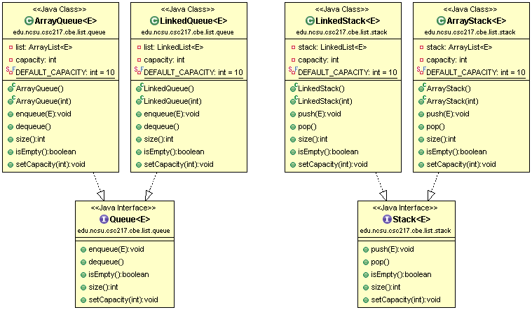

# CSC 217 CBE - Stacks and Queues

For the Stacks and Queues portion of the CBE you will complete the following tasks:

  * [Requirements](#requirements)
  * [Design](#design)
  * [Implement & Unit Test Stack](#implement-stack)
  * [Implement & Unit Test Queue](#implement-queue)
  * [Test & Coverage](#test)
  * [Algorithm Discussion](#algorithm)
  * [Review & Commit/Push](#review)
  * [Evaluation](#evaluation)
  
You are encouraged to commit/push your changes to GitHub frequently so that you do not lose work!

## Requirements
Implement a `Stack` and a `Queue` that meets the following requirements:

  * Automatically grows as elements are added
  * Throws `NullPointerException` for any null elements
  * Throws `IndexOutOfBoundsExceptions` for any index parameters that are out of bounds for the operation
  * Throws `IllegalArgumentExceptions` for any duplicate elements
  * Adds/removes elements as appropriate for the specialized data structure. No additional operations are allowed.

## Design
Use the following class diagram as the design for your implementation.  Additional details about expectations are in the [Implement Stack](#implement-stack) and [Implement Queue](#implement-queue) sections.

## Implement & Unit Test Stack

You will create a `Stack` interface and implement `ArrayStack` and `LinkedStack`.  Each concrete class will implement the interface and delegate to either `edu.ncsu.csc217.cbe.list.array.ArrayList` or `edu.ncsu.csc217.cbe.list.linked.LinkedList`.

### Create `Stack` Interface
Create a `Stack` interface in the `edu.ncsu.csc217.cbe.list.stack` package.  `Stack` has a generic type and 5 methods which are described below:

  * `void push(E element)`
     * Adds the element to the top of the stack
     * If there is no room (capacity has been reached), an `IllegalArgumentException` is thrown
  * `E pop()`
     * Removes and returns the element at the top of the stack
     * If the stack is empty, an `EmptyStackException()` is thrown
  * `boolean isEmpty()`: Returns true if the stack is empty
  * `int size()`: Returns the number of elements in the stack
  * `void setCapacity(int capacity)`
     * Sets the stack's capacity
     * If the actual parameter is negative or if it is less than the number of elements in the stack, an IllegalArgumentException is thrown
  
Javadoc `Stack`'s methods.

### Create `ArrayStack` and `LinkedStack`
Create `ArrayStack` and `LinkedStack` in `edu.ncsu.csc217.cbe.list.stack` package.  Both should implement `Stack`.  Leave the methods stubbed out until you have written your unit tests.

### Test!
Create `ArrayStackTest` and `LinkedStackTest` in `edu.ncsu.csc217.cbe.list.stack` package of the `test/` source folder.

Start by writing tests for `ArrayStackTest`.  When you're done, you can copy them into `LinkedStackTest` and update the tested object.

Consider the following cases:

  * Inserting a single element into the stack
  * Inserting multiple elements into the stack
  * Removing a single element from the stack
  * Removing multiple elements from the stack
  * Removing the last element from the stack
  * Interleaved inserts and removes
  * Attempting to remove an element from an empty stack
  * Setting the capacity to size
  * Attempting to set the capacity to less than size
  

### Implement `ArrayStack`
`ArrayStack` should have a field of type `edu.ncsu.csc217.cbe.list.array.ArrayList`.  `ArrayStack` will construct an `ArrayList` and delegate to the `ArrayList`.  

Note that since the current implementation of `ArrayList` does not have a capacity, the capacity functionality will be part of `ArrayStack`.  DO NOT add capacity to `ArrayList`!

### Implement `LinkedStack`
`LinkedStack` should have a field of type `edu.ncsu.csc217.cbe.list.linked.LinkedList`.  `LinkedStack` will construct a `LinkedList` and delegate to the `LinkedList`.

Since `LinkedList` does have a capacity, `LinkedStack` can delegate to `LinkedList` for the `setCapacity()` implementation.

## Implement & Unit Test Queue

You will create a `Queue` interface and implement `ArrayQueue` and `LinkedQueue`.  Each concrete class will implement the interface and delegate to either `edu.ncsu.csc217.cbe.list.array.ArrayList` or `edu.ncsu.csc217.cbe.list.linked.LinkedList`.

### Create `Queue` Interface
Create a `Queue` interface in the `edu.ncsu.csc217.cbe.list.queue` package.  `Queue` has a generic type and 5 methods which are described below:

  * `void enqueue(E element)`
     * Adds the element to the back of the Queue
     * If there is no room (capacity has been reached), an `IllegalArgumentException` is thrown
  * `E dequeue()`
     * Removes and returns the element at the front of the Queue
     * If the Queue is empty, an `NoSuchElementException` is thrown
  * `boolean isEmpty()`: Returns true if the Queue is empty
  * `int size()`: Returns the number of elements in the Queue
  * `void setCapacity(int capacity)`
     * Sets the Queue's capacity
     * If the actual parameter is negative or if it is less than the number of elements in the Queue, an 1IllegalArgumentException is thrown
  
Javadoc `Queue`'s methods.

### Create `ArrayQueue` and `LinkedQueue`
Create `ArrayQueue` and `LinkedQueue` in `edu.ncsu.csc217.cbe.list.queue` package.  Both should implement `Queue`.  Leave the methods stubbed out until you have written your unit tests.

### Test!
Create `ArrayQueueTest` and `LinkedQueueTest` in `edu.ncsu.csc217.cbe.list.queue` package of the `test/` source folder.

Start by writing tests for `ArrayQueueTest`.  When you're done, you can copy them into `LinkedQueueTest` and update the tested object.

Consider the following cases:

  * Inserting a single element into the Queue
  * Inserting multiple elements into the Queue
  * Removing a single element from the Queue
  * Removing multiple elements from the Queue
  * Removing the last element from the Queue
  * Interleaved inserts and removes
  * Attempting to remove an element from an empty Queue
  * Setting the capacity to size
  * Attempting to set the capacity to less than size
  

### Implement `ArrayQueue`
`ArrayQueue` should have a field of type `edu.ncsu.csc217.cbe.list.array.ArrayList`.  `ArrayQueue` will construct an `ArrayList` and delegate to the `ArrayList`.  

Note that since the current implementation of `ArrayList` does not have a capacity, the capacity functionality will be part of `ArrayQueue`.  DO NOT add capacity to `ArrayList`!

### Implement `LinkedQueue`
`LinkedQueue` should have a field of type `edu.ncsu.csc217.cbe.list.linked.LinkedList`.  `LinkedQueue` will construct a `LinkedList` and delegate to the `LinkedList`.

Since `LinkedList` does have a capacity, `LinkedQueue` can delegate to `LinkedList` for the `setCapacity()` implementation.

## Testing and Coverage
As you implement your stack and queue classes, you should also be unit testing them.  Make sure that you're testing the size AND contents (via add/remove operations) to ensure everything works correctly.

You are expected to achieve **80% statement coverage** of your stack and queue classes when running your tests.  Once you meet the coverage threshold from your passing tests, you will see the teaching staff test feedback on Jenkins.  Use the teaching staff tests to refine your tests and fix any bugs in your code.

Run static analysis tools and ensure that all notifications are fixed.

## Algorithm Discussion
Create a text file called `stack-queue.txt` in the `project_docs` directory.  Answer the following questions in the `stack-queue.txt` file:

  1. What is the runtime efficiency for the **add/push** operation for a **stack** implemented using an `ArrayList`?
  2. What is the runtime efficiency for the **add/push** operation for a **stack** implemented using an `LinkedList`?
  3. What is the runtime efficiency for the **add/push** operation for a **queue** implemented using an `ArrayList`?
  4. What is the runtime efficiency for the **add/push** operation for a **queue** implemented using an `LinkedList`?
  5. What is the runtime efficiency for the **remove/pop** operation for a **stack** implemented using an `ArrayList`?
  6. What is the runtime efficiency for the **remove/pop** operation for a **stack** implemented using an `LinkedList`?
  7. What is the runtime efficiency for the **remove/pop** operation for a **queue** implemented using an `ArrayList`?
  8. What is the runtime efficiency for the **remove/pop** operation for a **queue** implemented using an `LinkedList` with a back reference?
  9. Would you use an array or linked nodes for the underlying data structure to implement a stack?  Why?
  10. Would you use an array or linked nodes for the underlying data structure to implement a queue?  Why?

## Review
Ensure everything is pushed to the remote GitHub.  Check for the following:

  - `Stack`, `ArrayStack`, `LinkedStack` in `src/edu/ncsu/csc217/cbe/list/stack` directory
  - `Queue`, `ArrayQueue`, `LinkedQueue` in `src/edu/ncsu/csc217/cbe/list/queue` directory
  - `ArrayStackTest` and `LinkedStackTest` in `test/edu/ncsu/csc217/cbe/list/stack` directory
  - `ArrayQueueTest` and `LinkedQueueTest` in `test/edu/ncsu/csc217/cbe/list/queue` directory
  - `stack-queue.txt` in `project_docs` directory
  - Your tests are passing on Jenkins
  - Coverage of stack and queue classes exceeds 80% statement coverage
  - No notifications from static analysis tools
  - Javadoc your source and test classes
  - Teaching staff tests are passing on Jenkins

 