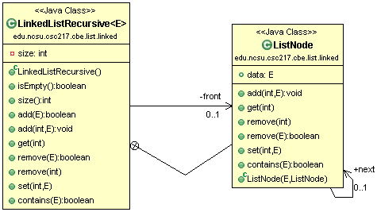

# CSC 217 CBE - Recursive Linked Lists

For the Recursive Linked Lists portion of the CBE you will complete the following tasks:

  * [Requirements](#requirements)
  * [Design](#design)
  * [Implement & Unit Test](#implement)
  * [Test & Coverage](#test)
  * [Review & Commit/Push](#review)
  * [Evaluation](#evaluation)
  
You are encouraged to commit/push your changes to GitHub frequently so that you do not lose work!

## Requirements
Implement a `LinkedListRecursive` that meets the following requirements:

  * Automatically grows as elements are added
  * Throws `NullPointerException` for any null elements
  * Throws `IndexOutOfBoundsExceptions` for any index parameters that are out of bounds for the operation
  * Throws `IllegalArgumentExceptions` for any duplicate elements

## Design
Use the following class diagram as the design for your implementation.  Additional details about expectations are in the [Implement](#implement) section.

## Implement & Unit Test

You will use test driven development to implement the custom `LinkedListRecursive`.  Each section below describes the methods that you will be implementing.

Consider the following questions as you implement `LinkedListRecursive`:

  * What is the base case?
     * An empty list?
     * Examining the first node in the list?
     * Reaching a specific index?
     * When next is null?
  * What happens to the parameters during recursion?
     * Are the same parameters passed for each recursive call?
     * Do the parameters’ values vary on each recursive call?
     * Are any parameters passed?
  * What is the return value?
     * Is the same value, when generated, returned up the call stack?
     * Does the return value build or accumulate as it’s returned up the call stack?
     * Is any value returned?

### Create `LinkedListRecursive` Class
Create `LinkedListRecursive` in the `src/` folder of the `edu.ncsu.csc217.cbe.list.linked` package.  

`LinkedListRecursive` should have a generic type parameter, `E`.

Add the methods specified in the design and add temporary return values like null or false so that the class compiles.

### Create `LinkedListRecursiveTest` Class
Create `LinkedListRecursiveTest` in the `test/` folder of the `edu.ncsu.csc217.cbe.list.linked.` package.  

Since the `LinkedListRecursiveTest` expected functionality is identical to `LinkedList`'s functionality, you should start from the `LinkedList` tests.  Copy those into `LinkedListRecursiveTest`. 

When testing, you should work with a list of `String`s.  Those will be easier to test that more complex objects like `Course`s.

### Start `ListNode`
`ListNode` is an inner class of `LinkedListRecursive`.  Add the class after the last method but before closing the `LinkedListRecursive` curly brace.  The `ListNode` class header should look like the following:

    private class ListNode { ... }
    
Note that `ListNode`'s class header has no generic type in this implementation.  `ListNode` will use `LinkedListRecursive`'s generic type.  

`ListNode` has two public fields and represents a node in a singly linked list.  Add the fields to the `ListNode` class:

  * `data`: type `E` - the data in the node
  * `next`: type `ListNode` - the next node in the list
  
`ListNode` needs only a single constructor.  Add the constructor to the `ListNode` class.  The constructor should assign the parameter to the associated fields:

  * `ListNode(E data, ListNode next)`
  
Add the methods specified in the design and add temporary return values such as null or false so that the class compiles.
  

### Implement `LinkedListRecursive` State
`LinkedListRecursive` has the following state:

  * `front`: a `ListNode`
  * `size`: the size of the list
  

### Implement and Test `LinkedListRecursive.LinkedListRecursive()`
The constructor of `LinkedListRecursive` should initialize the state to represent an empty list.  That means `front` is `null` and `size` is 0.

### Implement and Test `LinkedListRecursive.size()` and `LinkedListRecursive.isEmpty()`
Implement `size()` to return the `size` field.  `isEmpty()` should return true if `size` is 0.

### Implement and Test `LinkedListRecursive.contains(E)`
You'll start by implementing the functionality that checks if an element already exists in the list.  This will be used when adding to ensure that we have no duplicates.

This implementation will have a public/private pair of methods. The public method is `LinkedListRecursive.contains(E element)` and returns a `boolean`. The `private` method is `ListNode.contains(E element)`. The `public` method handles the special case of an empty list. If the list is not empty, then the `public` method transfers the flow of control to the private `ListNode.contains(E element)` method, which completes the recursion to check the elements in the list.

### Implement and Test `LinkedListRecursive.add(E)`
Next you'll implement the functionality that adds an element to the end of the list.

This implementation will have a public/private pair of methods. The public method is `LinkedListRecursive.add(E element)` and returns a `boolean`. The `private` method is `ListNode.add(E element)`. The `public` method checks that the `element` isn't already in the list (an `IllegalArgumentException` is thrown if the element already exists) and handles the special case of adding a node to an empty list. If the list is not empty, then the `public` method transfers the flow of control to the private `ListNode.add(E element)` method, which completes the recursion to add to element to the end of the list.

Don't forget to increment size on all paths where the `element` is added!

### Implement and Test `LinkedListRecursive.add(int, E)`
Next you'll implement the functionality that adds an element at an index.

This implementation will have a public/private pair of methods. The public method is `LinkedListRecursive.add(int idx, E element)`. The private method is `ListNode.add(int idx, E element)`. The `public`method checks that the `element` isn't already in the list (an `IllegalArgumentException` is thrown if the `element` already exists), handles bounds checking on the index (an `IndexOutOfBoundsException` is thrown for an invalid index), checks that the `element` isn't null (a `NullPointerException` is thrown if `element` is null), and the special case of adding a node to the front of the list. If the element is added to the middle or end of the list, then the `public` method transfers the flow of control to the `private` `ListNode.add(int idx, E element)` method, which completes the recursion to add to element at the appropriate location.

Don't forget to increment size on all paths where the `element` is added!

### Implement and Test `LinkedListRecursive.get(int)`
Next you'll implement the functionality that gets an element at an index.

This implementation will have a public/private pair of methods. The public method is `LinkedListRecursive.get(int idx)`. The private method is `ListNode.get(int idx)`. Both methods return the data in the `ListNode`. The `public` method handles bounds checking on the `index`. Then the public method transfers the flow of control to the `private` `ListNode.get(int idx)` method, which completes the recursion to get to element at the appropriate location.

### Implement and Test `LinkedListRecursive.remove(int)`
Next you'll implement the functionality that removes an element at an index.

This implementation will have a public/private pair of methods. The `public` method is `LinkedListRecursive.remove(int idx)`. The `private` method is `ListNode.remove(int idx)`. Both methods return the data of the removed `ListNode`. The public method handles bounds checking on the `index` and the special case of removing the first node in the list. Then the `public` method transfers the flow of control to the `private` `ListNode.remove(int idx)` method, which completes the recursion to remove to element at the appropriate location. You'll need to look ahead.

Don't forget to decrement size on all paths where the `element` is removed!

### Implement and Test `LinkedListRecursive.remove(E)`
Next you’ll implement the functionality that removes the provided element.

This implementation will have a public/private pair of methods. The `public` method is `LinkedListRecursive.remove(E element)`. The `private` method is `ListNode.remove(E element)`. Both methods return the true if the `element` is removed. The `public` method checks if the `element` is `null`, if the list is empty, and handles the special case of removing the first node in the list. Then the `public` method transfers the flow of control to the `private` `ListNode.remove(E element)` method, which completes the recursion to remove to element at the appropriate location.  You'll need to look ahead.

Don't forget to decrement size on all paths where the `element` is removed!

### Implement and Test `LinkedListRecursive.set(int, E)`
Next you’ll implement the functionality that sets an element at an index.

This implementation will have a public/private pair of methods. The `public` method is `LinkedListRecursive.set(int idx, E element)`. The `private` method is `ListNode.set(int idx, E element)`. Both methods return the `data`previously in the `ListNode`. The `public` method handles bounds checking on the `index`. Then the public method transfers the flow of control to the `private` `ListNode.set(int idx, E element)` method, which completes the recursion to set to element at the appropriate location.

## Test & Coverage
As you implement `LinkedListRecursive`, you should also be unit testing it.  Make sure that you're testing the size AND contents to ensure everything works correctly.

You are expected to achieve **80% statement coverage** of your `LinkedListRecursive` class when running your tests.  Once you meet the coverage threshold from your passing tests, you will see the teaching staff test feedback on Jenkins.  Use the teaching staff tests to refine your tests and fix any bugs in your code.

Run static analysis tools and ensure that all notifications are fixed.

## Review
Ensure everything is pushed to the remote GitHub.  Check for the following:

  - `LinkedListRecursive` in `src/edu/ncsu/csc217/cbe/list/linked` directory
  - `LinkedListRecursiveTest` in `test/edu/ncsu/csc217/cbe/list/linked` directory
  - Your tests are passing on Jenkins
  - Coverage of `LinkedListRecursive` exceeds 80% statement coverage
  - No notifications from static analysis tools
  - Javadoc your source and test classes
  - Teaching staff tests are passing on Jenkins

 